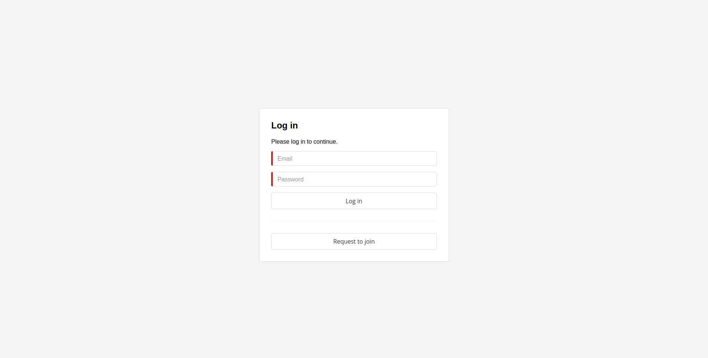
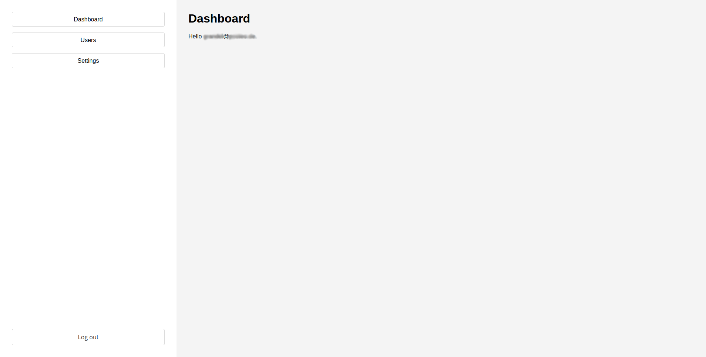
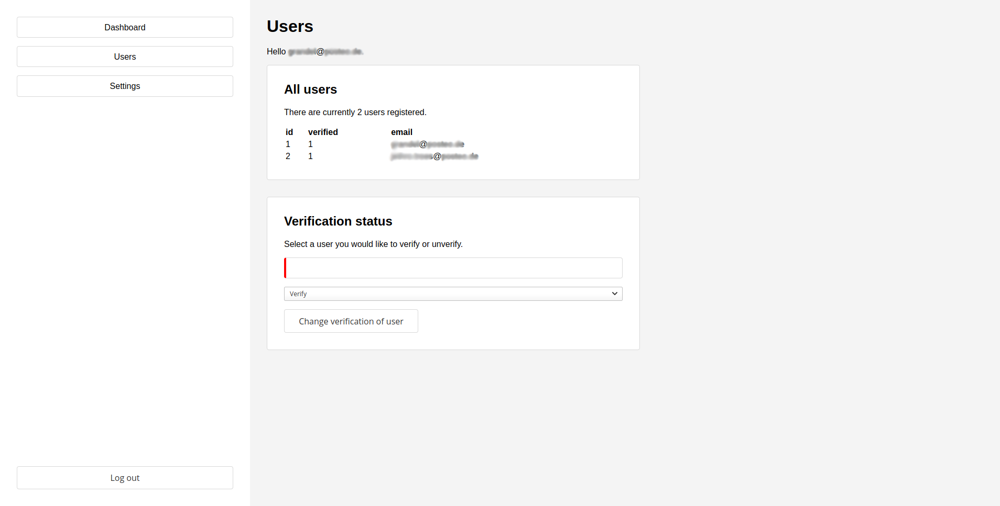
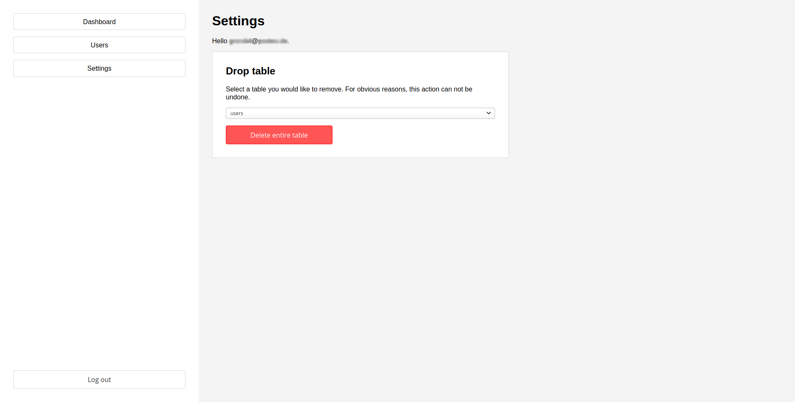

# Trees Hub #

A simple backend for still unclear purposes. This project is just practise.

## Screenshots ##

### Log in ###

### Dashboard ###

### Users ###

### Settings ###

## Features ##

### User management ###
[x] Create admin account if database is empty
[x] Log in / out (sessions)
[x] Request to join (verification by admin)

### Power management ###
[ ] currently every user can do everything (everybody is admin)

### User meta ###
[ ] Add extra information (profiles) to users which can be managed

### Responsive design ###
[ ] make layout work on all devices
